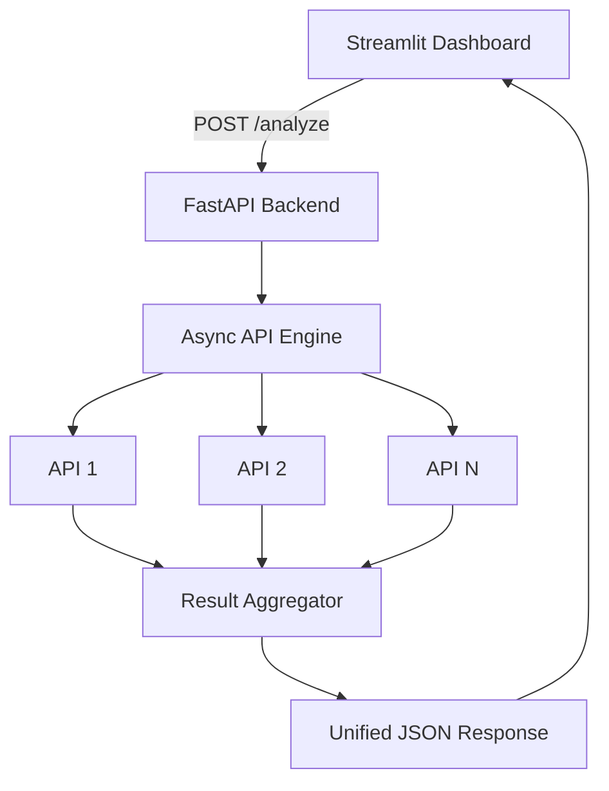

  
 <h3 align="center">Async Multi-API Intelligence Engine</h3> 
 Send requests to many APIs at once and get one unified result. 
 
 <b><a href="https://pulsh-mesh.streamlit.app/">Open the Live App</a></b> &nbsp;|&nbsp; <a href="https://pulse-ai-xkbk.onrender.com/docs">API Docs</a> 

## Overview

Pulsh AI is an asynchronous API intelligence engine built with Python. It calls multiple APIs concurrently, handles each request failure on its own, and combines everything into a single response.

A FastAPI backend does the work, and an interactive Streamlit dashboard shows the results.

---

## Features

- Concurrent API requests with asyncio and aiohttp
- Timeout and retry handling for each request
- Normalized responses with success status, HTTP status, data, and error details
- Unified results with total, successful, and failed request counts
- Interactive Streamlit dashboard
- REST API powered by FastAPI
- Backend hosted on Render, frontend on Streamlit Community Cloud

---

## Architecture

---

## Tech Stack

| Technology | Purpose |
|---|---|
| Python | Core language |
| FastAPI | Backend REST API |
| Uvicorn | ASGI server |
| asyncio + aiohttp | Concurrent HTTP requests |
| Pydantic | Request validation |
| Streamlit | Interactive frontend |
| Requests | Frontend-to-backend communication |
| Render | Backend hosting |

---

## Live Links

- **App:** [pulsh-mesh.streamlit.app](https://pulsh-mesh.streamlit.app/)
- **Backend:** [pulse-ai-xkbk.onrender.com](https://pulse-ai-xkbk.onrender.com)
- **Interactive API docs:** [/docs](https://pulse-ai-xkbk.onrender.com/docs)

---

## Error Handling

Pulsh AI is built to handle individual API failures, HTTP error responses, timeouts and retries, backend connection problems, and unexpected backend responses. Results depend on external API availability, network conditions, and hosting limits.

---

<b>Pulsh AI: Multiple APIs. One unified result.</b>

